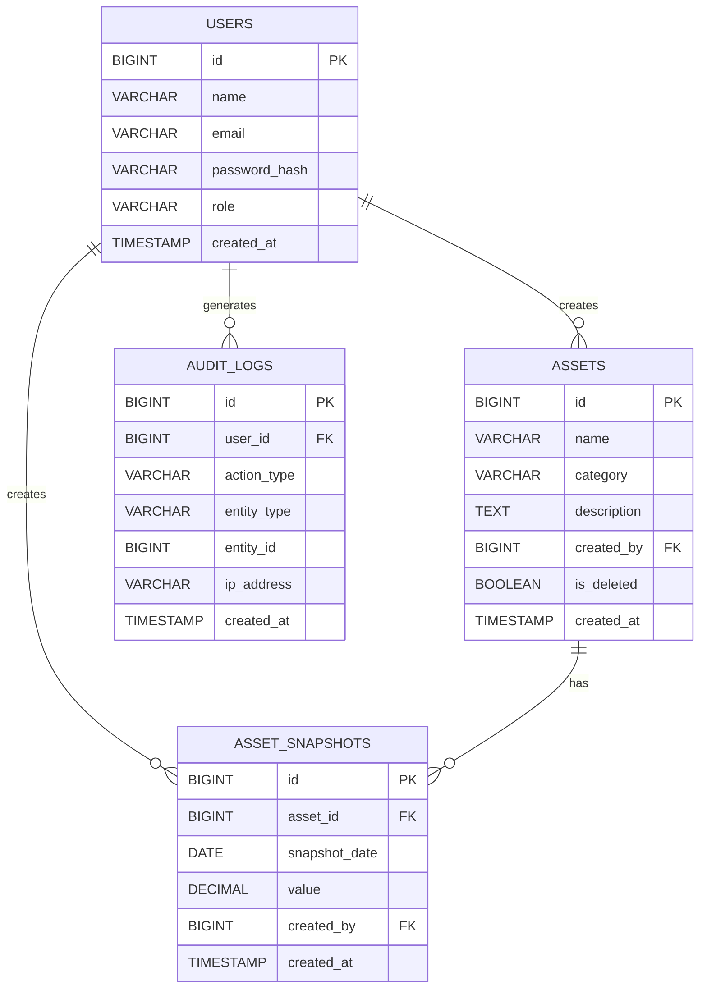

# 📊 ERD – Web-Based Personal Asset Management System

## 🗂 Entity Relationship Diagram (Mermaid)



---

# 📘 Entity Description

## 1️⃣ USERS

Menyimpan data user sistem.

| Field         | Type      | Description            |
| ------------- | --------- | ---------------------- |
| id            | BIGINT    | Primary Key            |
| name          | VARCHAR   | Nama user              |
| email         | VARCHAR   | Unique email           |
| password_hash | VARCHAR   | bcrypt hashed password |
| role          | ENUM      | `admin` atau `user`    |
| created_at    | TIMESTAMP | Waktu pembuatan        |

---

## 2️⃣ ASSETS

Menyimpan jenis aset (RDN Stockbit, Gold, Bitcoin, dll).

| Field       | Type      | Description                   |
| ----------- | --------- | ----------------------------- |
| id          | BIGINT    | Primary Key                   |
| name        | VARCHAR   | Nama aset                     |
| category    | ENUM      | stock / gold / crypto / other |
| description | TEXT      | Opsional                      |
| created_by  | BIGINT    | FK → users.id                 |
| is_deleted  | BOOLEAN   | Soft delete flag              |
| created_at  | TIMESTAMP | Created timestamp             |

---

## 3️⃣ ASSET_SNAPSHOTS

Menyimpan nilai aset berdasarkan tanggal tertentu.

| Field         | Type          | Description        |
| ------------- | ------------- | ------------------ |
| id            | BIGINT        | Primary Key        |
| asset_id      | BIGINT        | FK → assets.id     |
| snapshot_date | DATE          | Tanggal pencatatan |
| value         | DECIMAL(18,2) | Nilai dalam IDR    |
| created_by    | BIGINT        | FK → users.id      |
| created_at    | TIMESTAMP     | Waktu input        |

### 🔒 Constraints

- UNIQUE (asset_id, snapshot_date)
- snapshot_date <= CURRENT_DATE
- Update/Delete snapshot hanya jika snapshot_date = CURRENT_DATE
- email UNIQUE
- role ENUM: admin | user

---

## 4️⃣ AUDIT_LOGS

Mencatat seluruh aktivitas penting sistem.

| Field       | Type      | Description                                          |
| ----------- | --------- | ---------------------------------------------------- |
| id          | BIGINT    | Primary Key                                          |
| user_id     | BIGINT    | FK → users.id                                        |
| action_type | VARCHAR   | LOGIN / CREATE / UPDATE / DELETE / FORBIDDEN_ATTEMPT |
| entity_type | VARCHAR   | assets / snapshots / users                           |
| entity_id   | BIGINT    | ID entitas terkait                                   |
| ip_address  | VARCHAR   | IP Address user                                      |
| created_at  | TIMESTAMP | Waktu kejadian                                       |

---

# 🔗 Relationship Summary

| From   | To              | Relationship |
| ------ | --------------- | ------------ |
| USERS  | ASSETS          | 1-to-Many    |
| USERS  | ASSET_SNAPSHOTS | 1-to-Many    |
| USERS  | AUDIT_LOGS      | 1-to-Many    |
| ASSETS | ASSET_SNAPSHOTS | 1-to-Many    |

---

# ⚙️ Index Recommendation

```sql
CREATE UNIQUE INDEX idx_asset_snapshot_date
ON asset_snapshots(asset_id, snapshot_date);

CREATE INDEX idx_snapshot_date
ON asset_snapshots(snapshot_date);

CREATE INDEX idx_audit_user_created
ON audit_logs(user_id, created_at);

CREATE INDEX idx_assets_category
ON assets(category);
```
